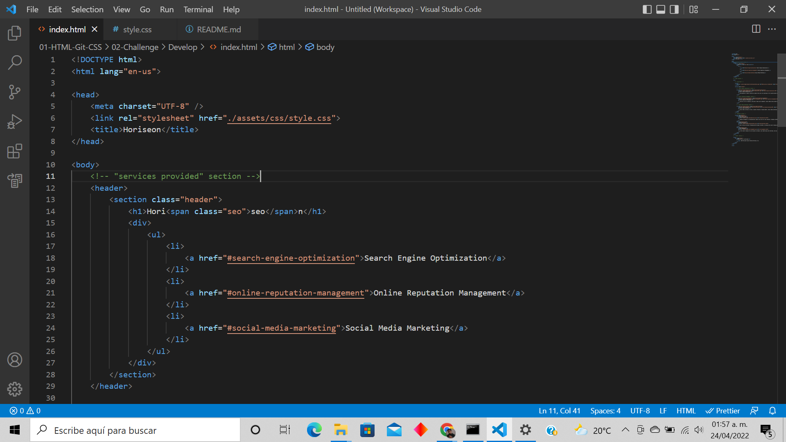
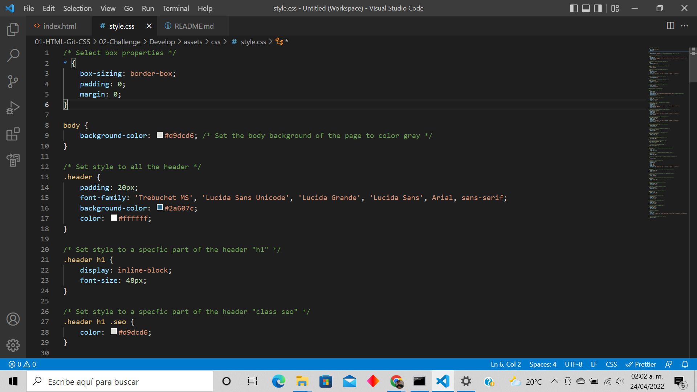

# Horiseon Description

The Horiseon webpage is now optimized for searh engines, so the clients that visit the webpage can access to this part of the webpage by just giving one clic to the "Search Engine Optimization" phrase. This option follows accessibility standards for the Horiseon visitors.

## URL of deployed application

https://israel2800.github.io/horiseon-challenge/

## URL of the GitHub Repository

https://github.com/Israel2800/horiseon-challenge.git

## HTML and CSS

I added semantic HTML elements for a better order and an accessible view, this is helpful for me at the time that I would like to make a change in the code. I ordered the elements following a logical structure in the index.html as well in the style.css files. The attribute "alt" was added to all the images, this is in case the webpage does not show the images. The heading attributes were addes in a sequential order. And finally the title was changed so it can be more clear and concise.

## Comments in index.html and style.css

I commented on each section that divides the index.html file as well the style.css, this for a better order at the time that I view the code. I changed some "div" for "section" so it would be easier to identify in which part in the code I am. I ordered the style.css in each corresponding section of the webpage, this makes the code look clean and easy to know where you are located if you want to do a change.

